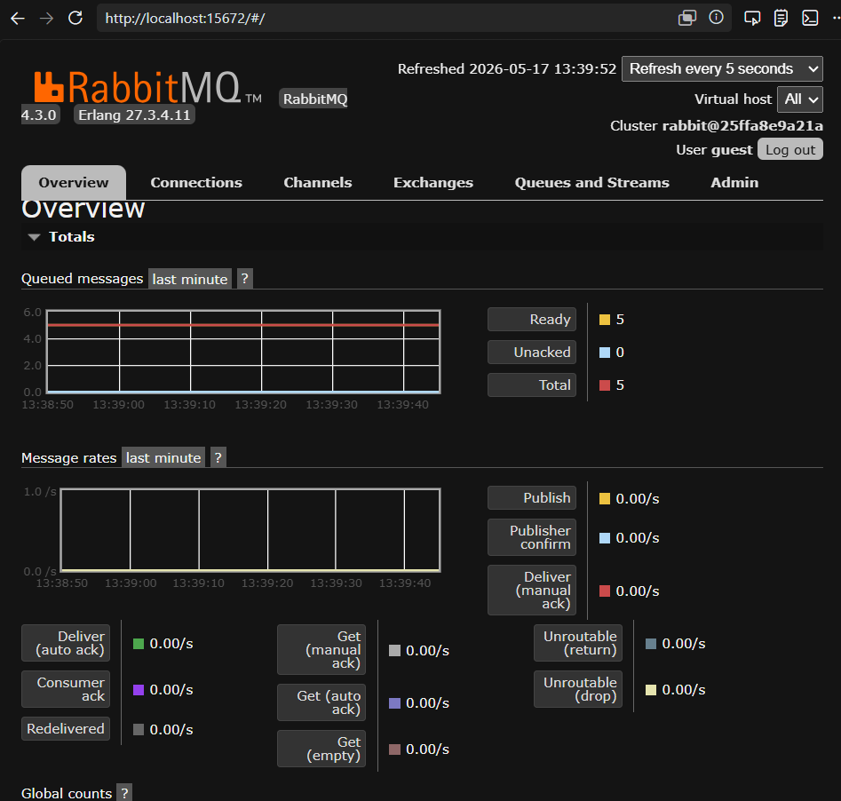
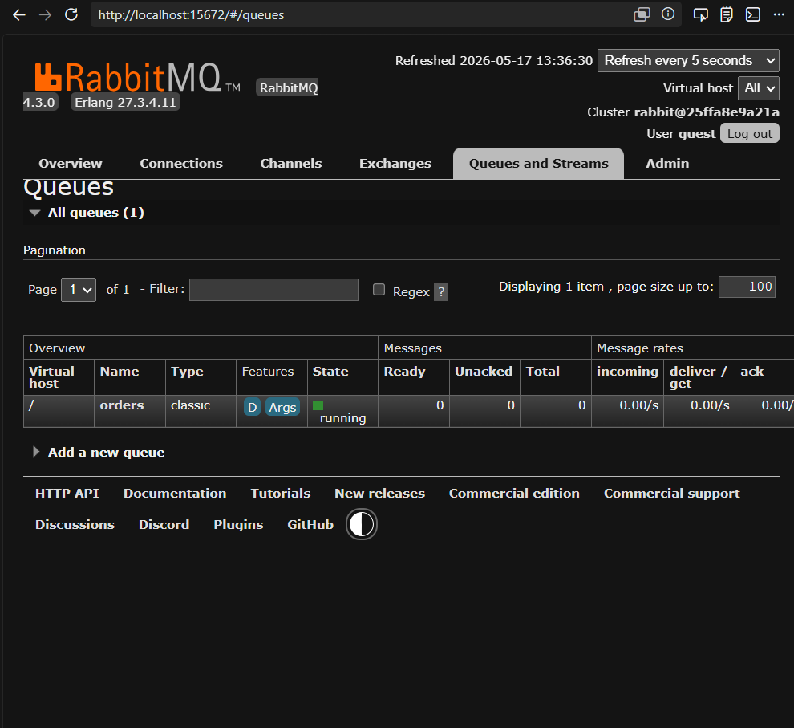

# Taller RabbitMQ - Mensajería Asincrónica

## Objetivo

Aprender a utilizar RabbitMQ para la mensajería asincrónica en aplicaciones Java y Python. Implementamos ejemplos prácticos para entender cómo enviar y recibir mensajes, desde un "Hello World" básico hasta un sistema de procesamiento de pedidos con conceptos avanzados.

## Pre-requisitos

- **Docker** instalado y corriendo
- **Python 3.x** con pip
- **Java 8+** con Maven
- **RabbitMQ** corriendo en Docker (ver instrucciones abajo)

## Estructura del Proyecto

```
rabbitmq-example/
├── pom.xml                          # Configuración Maven (Java)
├── python/
│   ├── producer.py                  # Ejemplo básico - Productor
│   ├── consumer.py                  # Ejemplo básico - Consumidor
│   ├── order_producer.py            # Sistema de pedidos - Productor
│   ├── order_consumer.py            # Sistema de pedidos - Consumidor
│   ├── requirements.txt             # Dependencias Python
│   └── README.md                    # Instrucciones Python
├── src/main/java/com/example/
│   ├── Producer.java                # Ejemplo básico - Productor Java
│   └── Consumer.java                # Ejemplo básico - Consumidor Java
└── images/
    ├── dashboard_ready.png          # Dashboard con mensajes en cola
    └── queues_consumed.png          # Cola vacía después de consumir
```

---

## Configuración del Entorno

### 1. Iniciar RabbitMQ con Docker

```bash
docker run -d --rm --name rabbitmq -p 5672:5672 -p 15672:15672 rabbitmq:4-management
```

- **Puerto 5672**: Conexión AMQP
- **Puerto 15672**: Panel de gestión en [http://localhost:15672](http://localhost:15672)
- **Credenciales**: `guest` / `guest`

### 2. Instalar dependencias de Python

```bash
pip install pika
```

### 3. Compilar proyecto Java

```bash
cd rabbitmq-example
mvn compile
```

---

## Paso 1: Configuración del Proyecto

### Java (`pom.xml`)

El archivo `pom.xml` incluye:
- **`amqp-client`**: Cliente oficial de RabbitMQ para Java
- **`slf4j-api`** y **`slf4j-simple`**: Logging para ver la actividad de conexión

### Python (`requirements.txt`)

```
pika==1.3.2
```

La biblioteca **pika** es el cliente oficial de RabbitMQ para Python.

---

## Paso 2: Ejemplo Básico (Hello World)

### Concepto

El ejemplo más simple de RabbitMQ: un **productor** envía un mensaje "Hello RabbitMQ!" a una cola llamada `hello`, y un **consumidor** lo recibe y lo imprime.

### Flujo

```
[Productor] --> "Hello RabbitMQ!" --> [Cola: hello] --> [Consumidor]
```

### Python

#### Productor (`producer.py`)

```python
import pika

connection = pika.BlockingConnection(pika.ConnectionParameters('localhost'))
channel = connection.channel()

channel.queue_declare(queue='hello')

channel.basic_publish(exchange='', routing_key='hello', body='Hello RabbitMQ!')
print(" [x] Sent 'Hello RabbitMQ!'")
connection.close()
```

**Explicación**:
1. Se conecta a RabbitMQ en `localhost`
2. Declara la cola `hello` (la crea si no existe)
3. Publica el mensaje con `basic_publish()`
4. Cierra la conexión

#### Consumidor (`consumer.py`)

```python
import pika

connection = pika.BlockingConnection(pika.ConnectionParameters('localhost'))
channel = connection.channel()

channel.queue_declare(queue='hello')

def callback(ch, method, properties, body):
    print(f" [x] Received {body}")

channel.basic_consume(queue='hello', on_message_callback=callback, auto_ack=True)

print(' [*] Waiting for messages. To exit press CTRL+C')
channel.start_consuming()
```

**Explicación**:
1. Se conecta y declara la misma cola
2. Define un `callback` que se ejecuta al recibir un mensaje
3. `auto_ack=True` confirma automáticamente el mensaje
4. `start_consuming()` mantiene el programa corriendo

### Java

#### Productor (`Producer.java`)

```java
ConnectionFactory factory = new ConnectionFactory();
factory.setHost("localhost");
try (Connection connection = factory.newConnection();
     Channel channel = connection.createChannel()) {
    channel.queueDeclare(QUEUE_NAME, false, false, false, null);
    String message = "Hello RabbitMQ!";
    channel.basicPublish("", QUEUE_NAME, null, message.getBytes());
    System.out.println(" [x] Sent '" + message + "'");
}
```

#### Consumidor (`Consumer.java`)

```java
ConnectionFactory factory = new ConnectionFactory();
factory.setHost("localhost");
try (Connection connection = factory.newConnection();
     Channel channel = connection.createChannel()) {
    channel.queueDeclare(QUEUE_NAME, false, false, false, null);
    System.out.println(" [*] Waiting for messages. To exit press CTRL+C");

    DeliverCallback deliverCallback = (consumerTag, delivery) -> {
        String message = new String(delivery.getBody(), "UTF-8");
        System.out.println(" [x] Received '" + message + "'");
    };
    channel.basicConsume(QUEUE_NAME, true, deliverCallback, consumerTag -> { });
}
```

---

## Paso 3: Sistema de Procesamiento de Pedidos

### Caso de Uso

Un sistema de e-commerce donde los clientes realizan pedidos y estos se procesan de forma **asincrónica**:

- El cliente no necesita esperar a que se procese el pedido
- Los pedidos se acumulan en una cola (buffer)
- El consumidor procesa cada pedido de forma independiente
- Se pueden agregar múltiples consumidores para escalar

### Flujo

```
[order_producer.py] --> JSON Order --> [Cola: orders (durable)] --> [order_consumer.py]
```

### Productor (`order_producer.py`)

Genera 5 pedidos aleatorios con datos realistas:

```python
order = {
    "order_id": "ORD-2639",
    "customer": "Bob",
    "items": [
        {"product": "Keyboard", "price": 59.99, "quantity": 2},
        {"product": "Mouse", "price": 29.99, "quantity": 1}
    ],
    "total": 149.97,
    "timestamp": "2026-05-17 13:35:00"
}
```

**Conceptos clave**:
- **JSON en mensajes**: Formato estándar para datos complejos
- **`durable=True`**: La cola persiste si RabbitMQ se reinicia
- **`delivery_mode=2`**: Mensajes guardados en disco (no se pierden)

### Consumidor (`order_consumer.py`)

Procesa cada pedido simulando validación, preparación y envío:

```
[PROCESSING] Order ORD-2639 for Bob
   Items: 2
     - Keyboard x2 ($59.99)
     - Mouse x1 ($29.99)
   Total: $149.97
   [OK] Order ORD-2639 processed successfully!
```

**Conceptos clave**:
- **`auto_ack=False`**: Confirmación manual con `basic_ack()` después de procesar
- **`basic_nack(requeue=True)`**: Si hay error, el mensaje vuelve a la cola
- **`basic_qos(prefetch_count=1)`**: Fair dispatch - cada consumidor recibe un mensaje a la vez

---

## Cómo Ejecutar

### Ejemplo Básico

**Terminal 1** - Iniciar consumidor:
```bash
python rabbitmq-example/python/consumer.py
```

**Terminal 2** - Enviar mensaje:
```bash
python rabbitmq-example/python/producer.py
```

### Sistema de Pedidos

**Terminal 1** - Iniciar consumidor de pedidos:
```bash
python rabbitmq-example/python/order_consumer.py
```

**Terminal 2** - Enviar pedidos:
```bash
python rabbitmq-example/python/order_producer.py
```

### Ejemplo Java

```bash
cd rabbitmq-example
mvn exec:java -Dexec.mainClass="com.example.Producer"
mvn exec:java -Dexec.mainClass="com.example.Consumer"
```

---

## Evidencia de Funcionamiento

### Dashboard con 5 mensajes en cola

Después de ejecutar el productor sin un consumidor activo, los mensajes se acumulan en la cola `orders`:



### Cola vacía después de consumir

Después de ejecutar el consumidor, todos los mensajes fueron procesados y confirmados:



### Salida del Productor

```
[*] Sending 5 orders...
[1] Sent order ORD-2639 for Bob - Total: $359.98
[2] Sent order ORD-3684 for Alice - Total: $149.97
[3] Sent order ORD-7159 for Alice - Total: $159.98
[4] Sent order ORD-9316 for Diana - Total: $519.95
[5] Sent order ORD-3480 for Alice - Total: $1299.98
[x] All 5 orders sent successfully!
```

### Salida del Consumidor

```
[*] Waiting for orders. To exit press CTRL+C

[PROCESSING] Order ORD-2639 for Bob
   Items: 3
     - Keyboard x2 ($59.99)
     - Monitor x1 ($299.99)
   Total: $359.98
   [OK] Order ORD-2639 processed successfully!

[PROCESSING] Order ORD-3684 for Alice
   Items: 2
     - Headphones x2 ($79.99)
   Total: $149.97
   [OK] Order ORD-3684 processed successfully!
...
```

---

## Conceptos Aprendidos

| Concepto | Descripción | Implementación |
|----------|-------------|----------------|
| **Mensajería asincrónica** | Productor y consumidor operan independientemente | Cola `orders` como buffer |
| **Persistencia de cola** | La cola sobrevive reinicios de RabbitMQ | `durable=True` en `queue_declare` |
| **Persistencia de mensajes** | Mensajes guardados en disco | `delivery_mode=2` en propiedades |
| **Confirmación manual** | El consumidor confirma solo después de procesar | `basic_ack(delivery_tag)` |
| **Manejo de errores** | Mensajes fallidos vuelven a la cola | `basic_nack(requeue=True)` |
| **Fair dispatch** | Balanceo justo entre consumidores | `basic_qos(prefetch_count=1)` |
| **Serialización JSON** | Datos complejos en el cuerpo del mensaje | `json.dumps(order)` |
| **Callback pattern** | Función que se ejecuta al recibir mensajes | `on_message_callback=callback` |
| **Exchange routing** | Mensajes dirigidos a cola específica | `routing_key='orders'` |

---

## Conclusión

RabbitMQ es una herramienta poderosa para la mensajería asincrónica y la integración de sistemas. En este taller:

1. **Configuramos** RabbitMQ con Docker y aprendimos a usar el panel de gestión
2. **Implementamos** el ejemplo básico "Hello World" en Java y Python
3. **Creamos** un sistema de procesamiento de pedidos con conceptos avanzados como persistencia, confirmación manual y fair dispatch
4. **Verificamos** el funcionamiento a través del dashboard y la ejecución de los scripts

Los conceptos explorados son fundamentales para construir aplicaciones distribuidas y escalables. Continuar practicando con estos temas y explorar otros aspectos de RabbitMQ (como exchanges tipo topic, fanout, dead letter queues, etc.) permitirá construir aplicaciones más robustas y eficientes.
